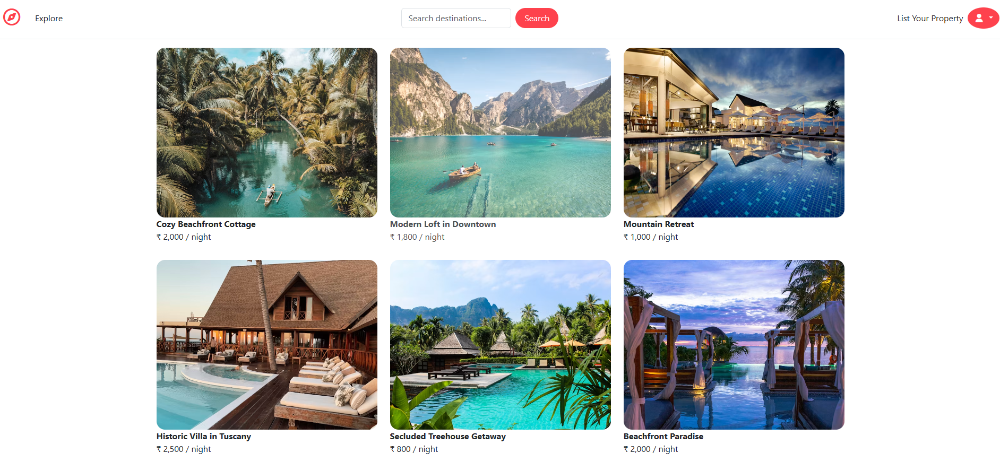
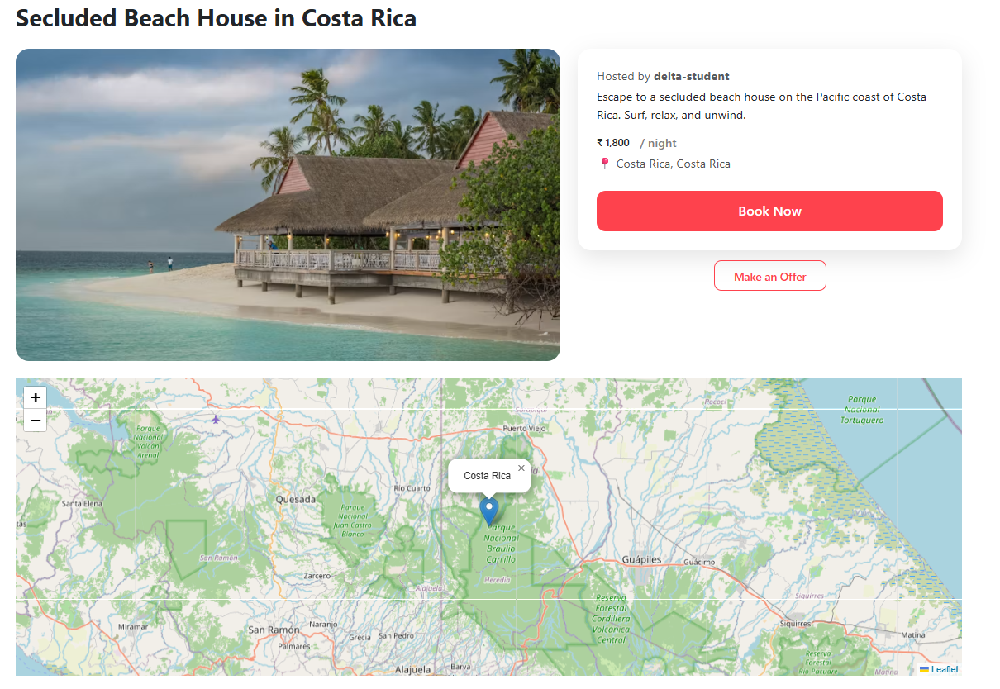
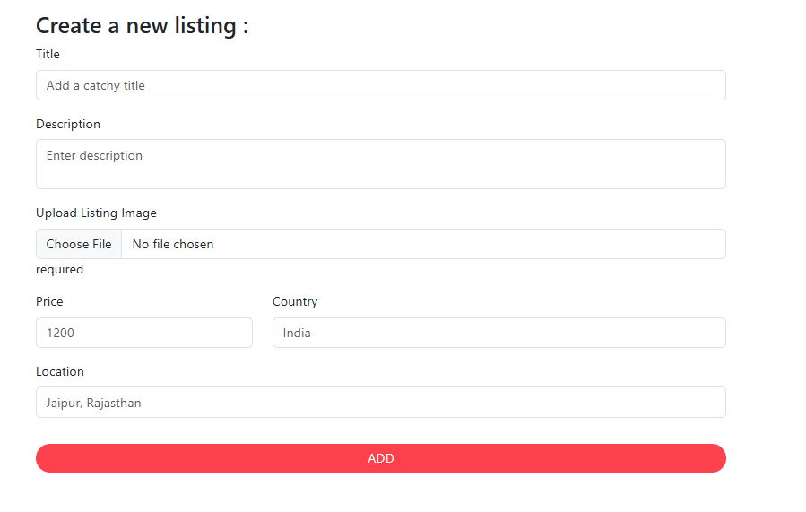
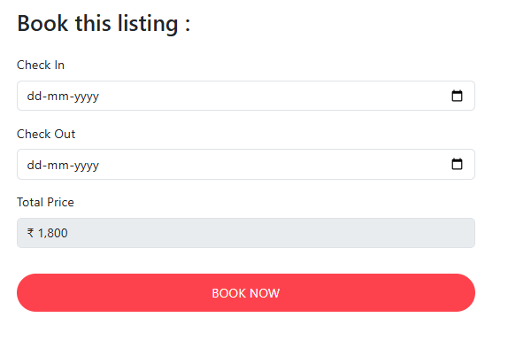
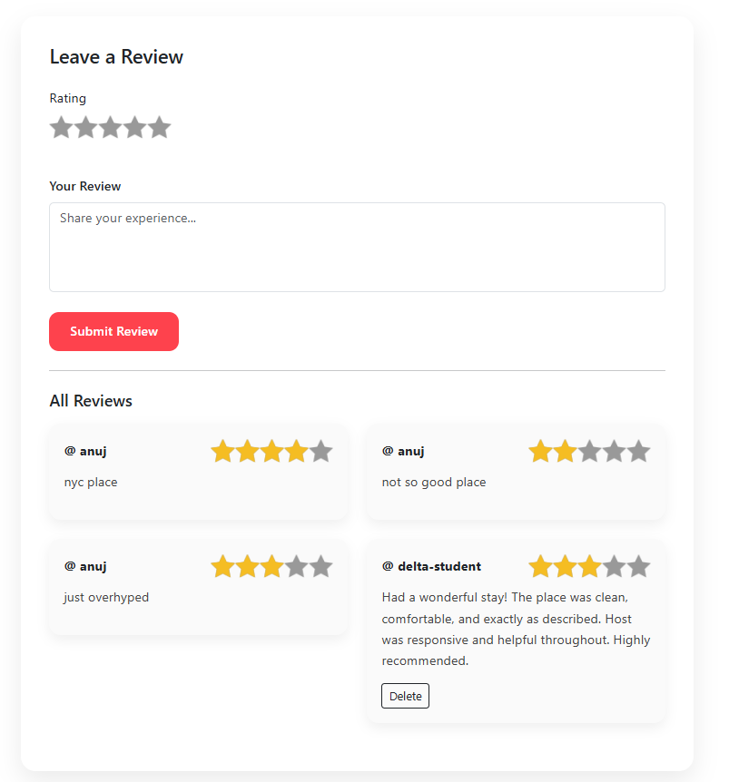
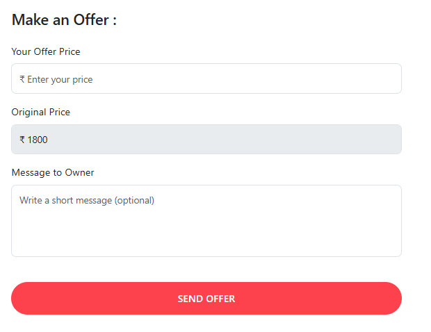

# 🏡 WanderLust

> A full-stack vacation rental platform inspired by Airbnb, built with Node.js, Express, MongoDB and EJS.

WanderLust is a vacation rental web application where users can explore properties, create and manage their own listings, make bookings, leave reviews, view property locations on an interactive map, and negotiate prices through an offer system.

---

## 🚀 Live Demo

**Coming Soon...**

---

## ✨ Features

### 🔐 Authentication & Authorization
- User registration and login
- Secure authentication using Passport.js
- Session-based authentication
- Authorization for listing and review operations

### 🏠 Listing Management
- Create new property listings
- Edit existing listings
- Delete listings
- View detailed listing information
- Upload listing images

### 🖼️ Image Management
- Image uploads using Multer
- Cloudinary integration for cloud-based image storage
- Automatic image URL management

### 🔎 Search
- Search listings based on location/title
- Browse available properties

### 🗺️ Interactive Maps
- Display listing locations on an interactive map
- Convert listing locations into geographical coordinates
- Show property markers on the map

### 📅 Booking System
- Book available properties
- Select check-in and check-out dates
- Calculate booking duration
- Prevent overlapping/double bookings
- View personal bookings

### ⭐ Reviews & Ratings
- Leave ratings and reviews on listings
- Display all reviews for a property
- Delete your own reviews
- Star-based rating interface

### 💰 Make an Offer
- Users can make custom price offers for listings
- Property owners can view incoming offers
- Owners can accept or reject offers
- Helps buyers and owners negotiate directly

---

## 📸 Screenshots

### 🏠 Home Page



---

### 🏘️ Listings



---

### ➕ Create Listing



---

### 📅 Bookings



---

### ⭐ Reviews



---

### 💰 Make an Offer



---

## 🛠️ Tech Stack

### Frontend

- EJS
- EJS-Mate
- Bootstrap
- CSS
- JavaScript

### Backend

- Node.js
- Express.js

### Database

- MongoDB
- Mongoose

### Authentication

- Passport.js
- Passport Local
- Passport Local Mongoose
- Express Session

### Image Storage

- Cloudinary
- Multer
- Multer Storage Cloudinary

### Maps & Geolocation

- Leaflet.js
- OpenStreetMap
- OpenCage Geocoding API

### Validation & Utilities

- Joi
- Axios
- Connect Flash
- Method Override
- Cookie Parser
- Dotenv

---

## 🗺️ Maps & Geolocation

WanderLust uses **OpenCage Geocoding API** to convert a listing's location into geographical coordinates.

These coordinates are stored with the listing and are then used by **Leaflet.js** to display the property's location on an interactive map.

The map tiles are provided by **OpenStreetMap**.

### Flow

```text
User enters location
        ↓
OpenCage Geocoding API
        ↓
Latitude + Longitude
        ↓
Coordinates stored in MongoDB
        ↓
Leaflet.js
        ↓
Interactive Map + Property Marker


📅 Booking System

Users can book available properties by selecting:

Check-in date
Check-out date

The application calculates the number of nights and validates booking availability.

Double Booking Prevention

Before creating a booking, existing bookings are checked for overlapping dates.

This prevents multiple users from booking the same property for the same period.


💰 Make an Offer

WanderLust includes a negotiation feature that allows users to make custom price offers on listings.

Buyer

A buyer can:

Enter an offered price
Send an offer to the property owner
Track the offer status
Owner

A property owner can:

View incoming offers
Accept an offer
Reject an offer

Offer Flow

Buyer
  ↓
Makes an Offer
  ↓
Property Owner
  ↓
Accept / Reject
  ↓
Offer Status Updated


⭐ Review System

Authenticated users can leave reviews on listings.

Each review contains:

Rating
Comment
Author

Users can also delete their own reviews.


🔐 Authentication

Authentication and authorization are implemented using Passport.js.

Users can:

Register
Login
Logout
Create listings
Edit and delete their own listings
Manage their bookings
Submit reviews
Make offers


📂 Project Structure

WanderLust/
│
├── controllers/
├── models/
├── routes/
├── views/
├── public/
├── utils/
│
├── Screenshots/
│   ├── home.png
│   ├── listing.png
│   ├── create-listing.png
│   ├── bookings.png
│   ├── reviews.png
│   └── offers.png
│
├── app.js
├── cloudConfig.js
├── middleware.js
├── schema.js
├── package.json
├── package-lock.json
└── README.md


⚙️ Getting Started
Prerequisites

Make sure you have the following installed:

Node.js
npm
MongoDB / MongoDB Atlas
Cloudinary account
OpenCage API key


1. Clone the Repository
git clone https://github.com/neeraj070105/WanderLust.git

2. Navigate to the Project
cd WanderLust

3. Install Dependencies
npm install

🔐 Environment Variables

Create a .env file in the root directory.

ATLASDB_URL=your_mongodb_connection_string
SECRET=your_session_secret

CLOUD_NAME=your_cloudinary_cloud_name
CLOUD_API_KEY=your_cloudinary_api_key
CLOUD_API_SECRET=your_cloudinary_api_secret

OPENCAGE_API_KEY=your_opencage_api_key


▶️ Run Locally

Start the application using: nodemon app.js

The application will available at:
http://localhost:8080


🔄 Application Flow
User
 │
 ├── Register / Login
 │
 ├── Browse Listings
 │      │
 │      ├── Search
 │      └── View Property
 │
 ├── Create Listing
 │      │
 │      ├── Upload Image → Cloudinary
 │      └── Location → OpenCage → Coordinates
 │
 ├── Book Property
 │      │
 │      └── Check Date Availability
 │
 ├── Leave Review
 │
 └── Make an Offer
        │
        └── Owner Accepts / Rejects


🧩 Key Concepts Used
RESTful Routing
MVC Architecture
CRUD Operations
Authentication & Authorization
Session Management
MongoDB Relationships
Mongoose Population
Middleware
Server-Side Rendering with EJS
Image Upload & Cloud Storage
API Integration
Geocoding
Interactive Maps
Date-Based Booking Validation
Review & Rating System
Offer Negotiation Workflow


🔮 Future Improvements
Online payment integration
Wishlist / Favorites
Advanced filtering and sorting
Email notifications
User profile pages
Admin dashboard
Improved availability calendar
Better mobile optimization


👨‍💻 Author
Neeraj Bansal

GitHub: https://github.com/neeraj070105/WanderLust


📄 License

This project was developed for learning and portfolio purposes.